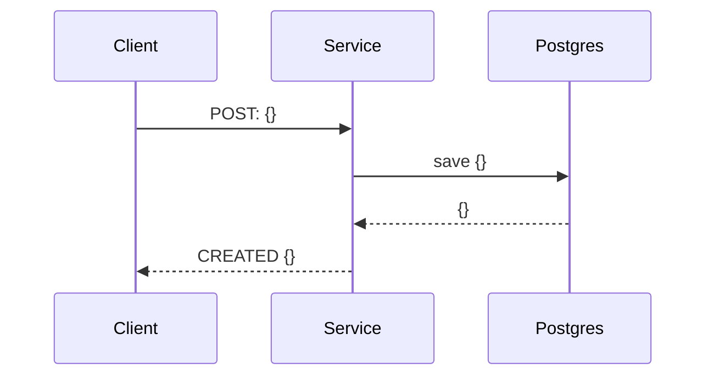
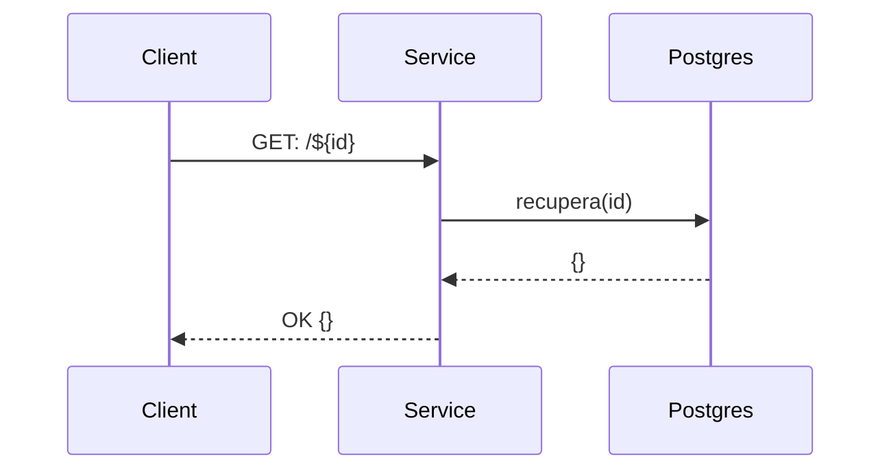
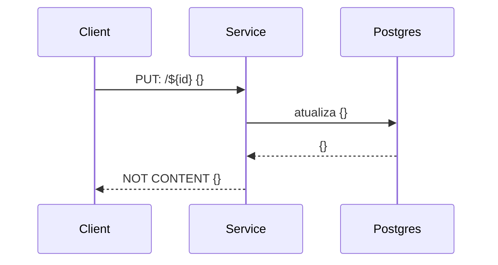
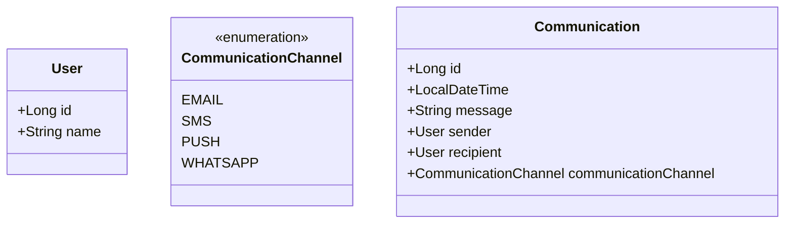

# Message Service

## Use cases
### Use Case 1: *Communication Send Scheduling*

### Use Case 2: *Consultation of communication submission*

### Use Case 3: *Cancellation of sending the communication*

