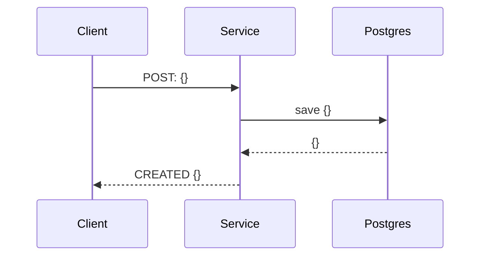
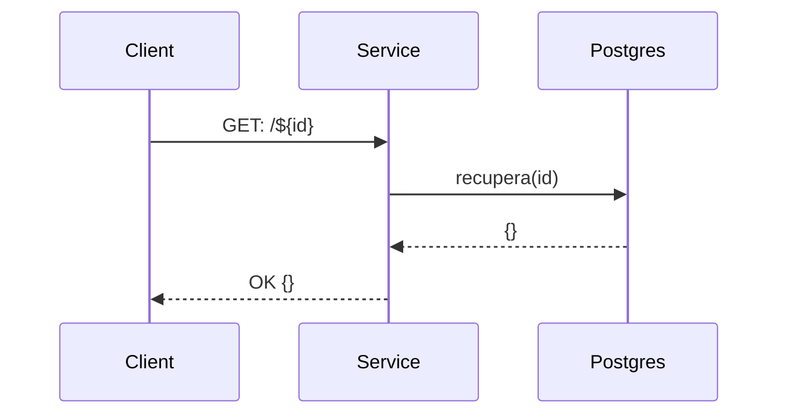
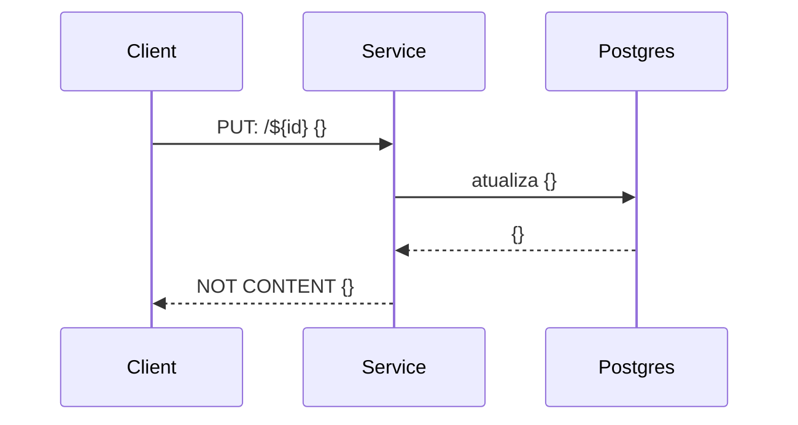
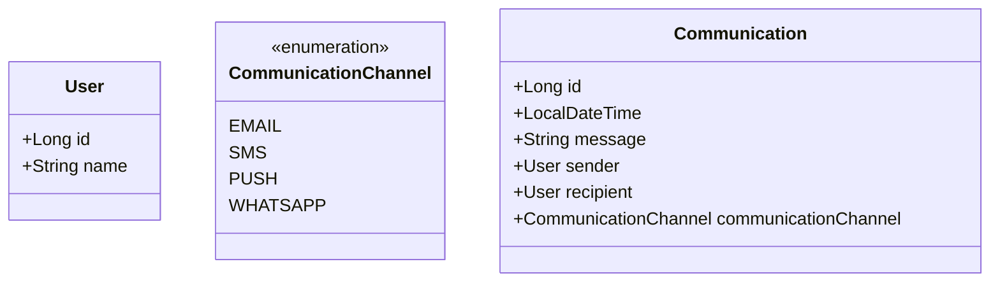

# Message Service

## Use cases
### Use Case 1: *Communication Send Scheduling*


````shell
curl --location --request POST 'localhost:9000/report' \
--header 'correlationId: 83b868e2-9a61-45d2-86e0-549609c38938' \
--header 'Content-Type: application/json' \
--data-raw '{
    "recipient": 1,
    "send_date": "2022-02-01T00:00:00",
    "message": "Feliz Ano Novo!",
    "channel": "WHATSAPP"
}'
````

### Use Case 2: *Consultation of report submission*


### Use Case 3: *Cancellation of sending the report*




## Rotas
### Health Check
```shell
curl --location --request GET 'http://localhost:9000/actuator/health'
```