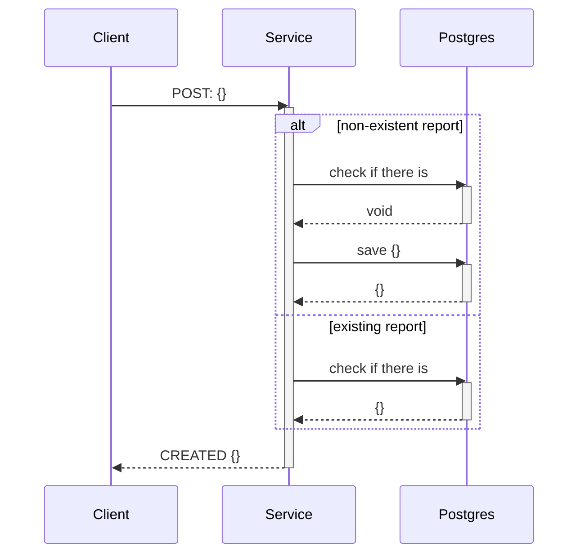
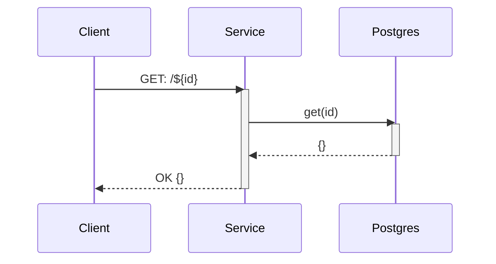
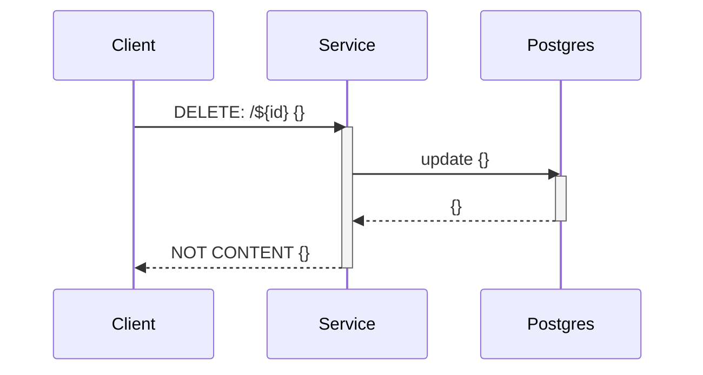
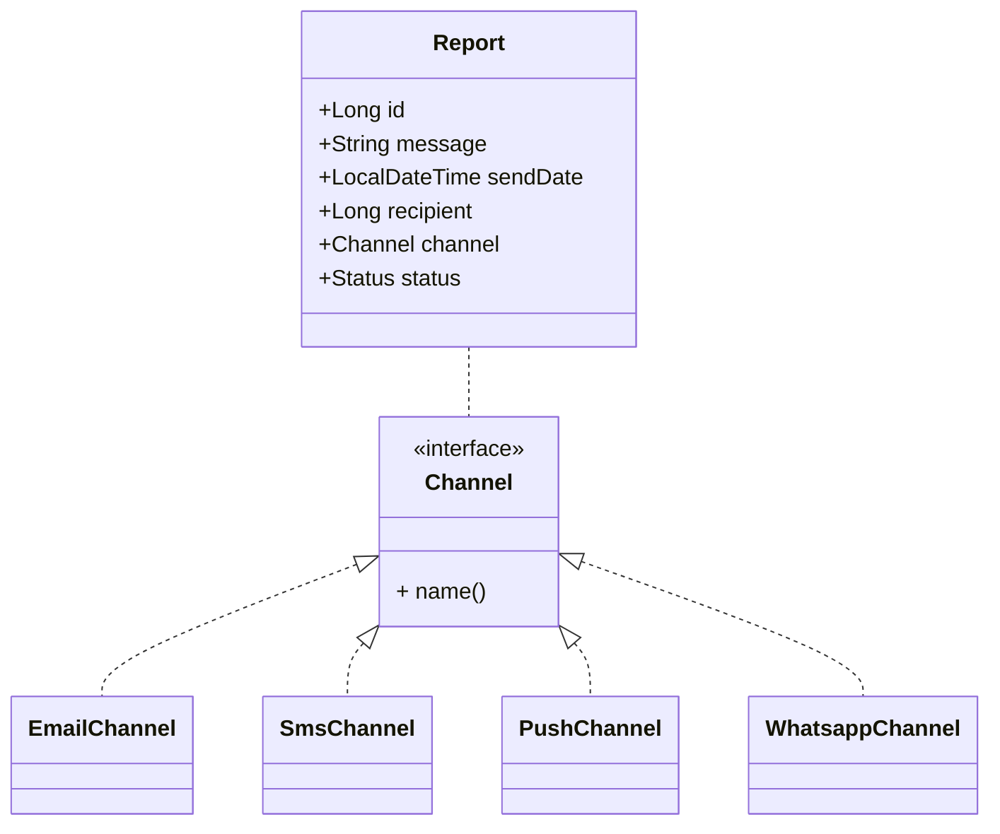
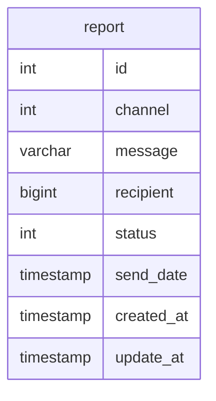

# Message Service

## Project Configuration
- first step is to upload docker container with PostgreSql Database
```shell
docker-compose up
```
- second step is to add the environment variables, in your IDE of choice. I advise using Intellij IDEA.
```
SERVER_PORT=9000

DATASOURCE_URL=jdbc:postgresql://localhost:5432/message_service
DATASOURCE_USERNAME=admin
DATASOURCE_PASSWORD=1q2w3e4r
```

## Use cases
### Use Case 1: *Communication Send Scheduling*


```shell
curl --location --request POST 'localhost:9000/report' \
--header 'correlationId: 83b868e2-9a61-45d2-86e0-549609c38938' \
--header 'Content-Type: application/json' \
--data-raw '{
    "recipient": 1,
    "send_date": "2022-02-01T00:00:00",
    "message": "Feliz Ano Novo!",
    "channel": "WHATSAPP"
}'
```

### Use Case 2: *Consultation of report submission*


```shell
curl --location --request GET 'localhost:9000/report/1'
```

### Use Case 3: *Cancellation of sending the report*


```shell
curl --location --request DELETE 'localhost:9000/report/1'
```

## Class Diagram


## Entity and Relationship


## Rotas
### Health Check
```shell
curl --location --request GET 'http://localhost:9000/actuator/health'
```

### Open API
> http://localhost:9000/swagger-ui.html